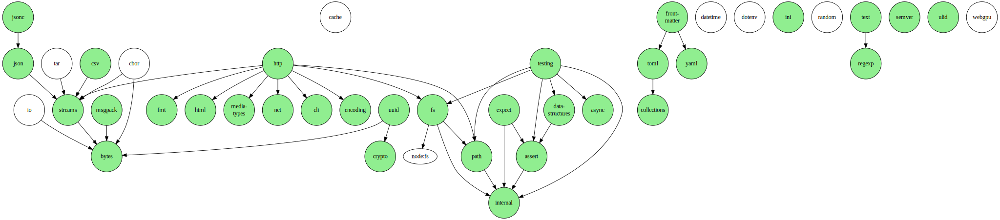

# Architecture Guide

This guide aims to explain how this codebase is organized.

## File Structure

### `_tools`

This folder contains internal tools that are used in CI and development for
checking code and documentation.

### `<package>`

Each package is encapsulated as a top-level folder, without the prepended
underscore in the name.

### `<package>/deno.json`

This is the
[package configuration file](https://jsr.io/docs/publishing-packages#package-config-file).
It contains package settings such as name, version and exports of the given
package.

### `<package>/mod.ts`

These files are typically the entry points for their respective packages. They
export all public symbols within that package. For example, `foo/mod.ts`.

### `<package>/<src>.ts`

The source files are where APIs are implemented. Each file exports APIs that are
highly likely to be used together. This sometimes means the source file only
exports one or two APIs, as they are unlikely to be used with another specific
API. In most cases, the name of the source file is the name of the main API that
it implements,
[snake cased](https://developer.mozilla.org/en-US/docs/Glossary/Snake_case). For
example, `foo/bar.ts` contains the implementation of the `Bar` class.

### `<package>/<src>_test.ts`

Each source file comes with a corresponding test file. The test file contains
the tests for the APIs within the source file. For example, the source file,
`foo/bar.ts`, has test file, `foo/bar_test.ts`.

### `deno.json`

This is the
[configuration file](https://docs.deno.com/runtime/manual/getting_started/configuration_file)
for this codebase. It contains settings and tasks that apply to the codebase as
a whole.

## Design

### Minimal Exports

Files are structured to minimize the number of dependencies they incur and the
amount of effort required to manage them, both for the maintainer and the user.
In most cases, only a single function or class, alongside its related types, are
exported. In other cases, functions that incur negligible dependency overhead
will be grouped together in the same file.

## Dependency Graph

