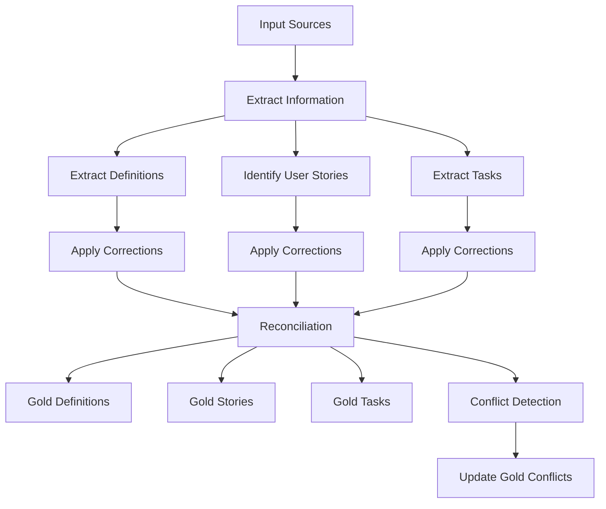

# The Reasoner Knowledge Management System

This repository contains a workflow system designed to analyze and process multi-channel communications to extract and maintain consistent project definitions, user stories, and tasks.

## Purpose

The system processes information from multiple sources including:

- Conversations
- Meetings
- Documents
- Notes

## Core Functionality

### Definition Extraction

For each piece of source material, the system:

1. Extracts key definitions
2. Identifies user stories and narratives
3. Extracts tasks
4. Applies corrections for common transcription errors
5. Reconciles new information against existing "gold" reference data

### Conflict Management

When conflicts are detected between extracted and gold definitions, stories, or tasks:

- Conflicts are automatically flagged
- Reasons for conflicts are documented
- Items are tracked in a "Gold Conflicts" file for team discussion

## File Structure

### Naming Convention

Files follow this pattern:
`[DATE]_[TYPE].md`

Where TYPE can be:

- transcript
- definitions
- narratives
- tasks

### Definition Hierarchy

Definitions are organized in a tree structure using:

- Kebab-case for node names
- Underscores to represent folder hierarchy
- This format ensures AI-system compatibility

### Definition and Task Files (NOT IMPLEMENTED)

Each definition and task is stored in a separate file. This approach serves two main purposes:

1. **Knowledge Tree Relationships**: Storing each item individually allows for a clear representation of the relationships within the knowledge tree. Each file corresponds to a specific node, making the structure intuitive and easier to navigate.

2. **Change Tracking**: Keeping items in separate files enhances version
   control. Changes are isolated to specific files, reducing noise in diffs and
   making it easier to review proposed modifications. This granularity improves
   collaboration and maintains the integrity of the knowledge base.

## Process

