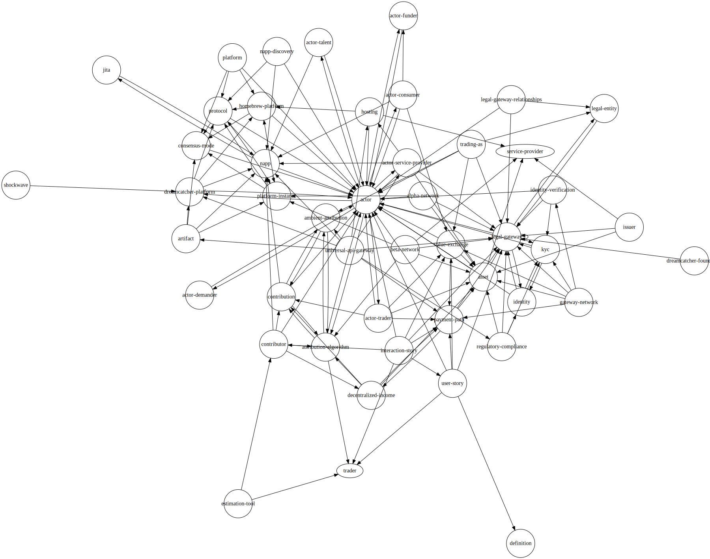

# The Reasoner Knowledge Management System

This repository contains a workflow system designed to analyze and process
multi-channel communications to extract and maintain consistent project
definitions, user stories, and tasks.

## Purpose

The system processes information from multiple sources including:

- Conversations
- Meetings
- Documents
- Notes

## Core Functionality

### Knowledge Extraction

For each piece of source material, the system:

1. Extracts key definitions
2. Identifies user stories and narratives
3. Extracts tasks
4. Applies corrections for common transcription errors
5. Reconciles new information against existing "gold" reference data

### Definition Standards

Definitions must be:

1. **Implementation Agnostic**

   - Focus on core properties and characteristics
   - Describe capabilities without specifying technology
   - Use abstract concepts rather than specific implementations
   - Can include examples but must clarify they are just possibilities

2. **Property-Focused**

   - Describe fundamental attributes
   - Explain behavioral characteristics
   - Define relationships and interactions
   - Specify constraints and requirements

3. **Technology Neutral**
   - Avoid referencing specific platforms or technologies
   - Use general terms for technical concepts
   - Focus on what something does, not how it does it
   - Allow for multiple possible implementations

### Conflict Management

When conflicts are detected between extracted and gold definitions, stories, or
tasks:

- Conflicts are automatically flagged
- Reasons for conflicts are documented
- Items are tracked in a "Gold Conflicts" file for team discussion

## File Structure

### Naming Convention

Files follow this pattern: `[DATE]_[TYPE].md`

Where TYPE can be:

- transcript
- definitions
- narratives
- tasks

### Documentation Standards

#### File Naming

- All files must have the `.md` extension
- Use kebab-case for file names (e.g., `legal-gateway.md`)
- Avoid spaces or special characters in filenames
- Keep filenames lowercase

#### Link Standards

1. **Internal Links**

   - Always include the `.md` extension: `[Legal Gateway](legal-gateway.md)`
   - For section references, use `#` with lowercase: `[Funder](actor.md#funder)`
   - Links should be relative to the current folder
   - Verify links point to existing files

2. **Cross-References**

   - All terms defined in other files should link to their definitions
   - Use exact file names when linking (case-sensitive)
   - Avoid "./" prefix in links

3. **Formatting**
   - Use square brackets for link text: `[Text]`
   - Use regular parentheses for link target: `(file.md)`
   - Maintain consistent capitalization in link text

#### Content Standards

1. **Naming Consistency**

   - Use consistent product names (e.g., "Dreamcatcher" not "Dream Catcher")
   - Maintain consistent terminology across all files
   - Capitalize proper nouns consistently

2. **Document Structure**

   - Each file should have a title as first-level heading
   - Include Definition and Description sections
   - Use consistent heading levels
   - Use bullet points for lists

3. **Markdown Formatting**
   - Use bold (`**text**`) for emphasis in definitions
   - Use bullet points (`-`) for lists
   - Use numbered lists (`1.`) for sequential items
   - Use code blocks for technical content

### Definition Hierarchy

Definitions are organized in a tree structure using:

- Kebab-case for node names
- Underscores to represent folder hierarchy
- This format ensures AI-system compatibility

### Definition and Task Files

Each definition and task is stored in a separate file. This approach serves two
main purposes:

1. **Knowledge Tree Relationships**: Storing each item individually allows for a
   clear representation of the relationships within the knowledge tree. Each
   file corresponds to a specific node, making the structure intuitive and
   easier to navigate.

2. **Change Tracking**: Keeping items in separate files enhances version
   control. Changes are isolated to specific files, reducing noise in diffs and
   making it easier to review proposed modifications. This granularity improves
   collaboration and maintains the integrity of the knowledge base.

## Process




## Token Count

```shell
deno task tokens
```

Total number of tokens: **10,646** (o1-preview)
