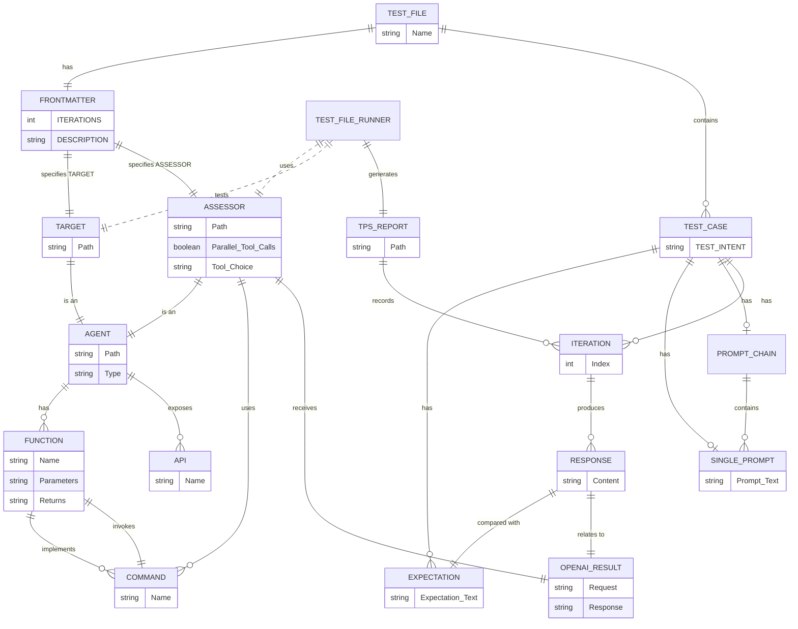

# Test Process Entity-Relationship Diagram (ERD)

## ERD

### ERD Explanation

- **Entities:**
  - **ASSESSOR**: Added attributes `Parallel_Tool_Calls` (boolean) and
    `Tool_Choice` to reflect the configuration.
  - **OPENAI_RESULT**: Represents the result obtained from the
    `test-case-runner:openai` function, containing `Request` and `Response`.
  - **COMMAND**: Represents commands such as `test-case-runner:openai` and
    `test-case-runner:assessment`.
  - **RESPONSE**: Adjusted to show its relation to `OPENAI_RESULT`.

- **Relationships:**
  - `ASSESSOR` **uses** `COMMAND`s.
  - `ASSESSOR` **receives** `OPENAI_RESULT` from invoking commands.
  - `COMMAND`s **invoke** `FUNCTION`s.
  - `AGENT` **has** `FUNCTION`s and **exposes** an `API`.
  - `TARGET` and `ASSESSOR` are types of `AGENT` (indicated by "is an").

---

## Rules

---

### Entities and Definitions

1. **TEST_FILE**
   - **Description**: A markdown file ending with `.test.md` that specifies
     tests to be run against a TARGET using an ASSESSOR.
   - **Attributes**:
     - `Name`: The name of the TEST FILE.
   - **Rules**:
     - Must end with `.test.md` (**Priority Rule 1**).
     - Must contain exactly one **FRONTMATTER**.
     - Must contain at least one **TEST_CASE**.
     - Must specify a specific **TARGET** in the FRONTMATTER (**Priority Rule
       2**).

2. **FRONTMATTER**
   - **Description**: A YAML section at the beginning of a TEST FILE providing
     configuration parameters.
   - **Attributes**:
     - `TARGET` (required): Path to the TARGET AGENT (within `/agents/`).
     - `ASSESSOR` (required): Path to the ASSESSOR AGENT (within `/agents/`).
     - `ITERATIONS` (optional): Positive integer indicating the number of
       variations of each TEST to run (defaults to 1 if missing).
     - `DESCRIPTION` (optional): Description of what the TEST FILE intends to
       test.
   - **Rules**:
     - Must be placed before any TEST_CASEs.
     - Is required in every TEST FILE.

3. **TEST_CASE**
   - **Description**: A single test resulting in a pass or fail when run by the
     TEST_FILE_RUNNER.
   - **Attributes**:
     - `TEST_INTENT`: High-level description of the TEST_CASE's purpose.
   - **Components**:
     - Either a **SINGLE_PROMPT** or a **PROMPT_CHAIN**.
     - One or more **EXPECTATION**s.
   - **Rules**:
     - Must include a `TEST_INTENT`.
     - Must have one or more `EXPECTATION`s.
     - Responses must meet all EXPECTATIONs considering the TEST_INTENT.

4. **SINGLE_PROMPT**
   - **Description**: A single prompt used in a TEST_CASE.
   - **Attributes**:
     - `Prompt_Text`: The natural language input.
   - **Rules**:
     - Has an EXPECTATION regarding the result against the TARGET.

5. **PROMPT_CHAIN**
   - **Description**: A sequence of SINGLE_PROMPTs executed in order.
   - **Components**:
     - Contains one or more `SINGLE_PROMPT`s.
   - **Rules**:
     - Expectations are evaluated after the last prompt.

6. **EXPECTATION**
   - **Description**: Expected outcome after running a SINGLE_PROMPT or
     PROMPT_CHAIN.
   - **Attributes**:
     - `Expectation_Text`: The expected result.
   - **Rules**:
     - Responses must reasonably meet the EXPECTATION, considering the
       TEST_INTENT.

7. **TARGET** and **ASSESSOR**
   - **Description**: Specialized types of `AGENT`.
   - **Attributes**:
     - `Path`: File path to the AGENT (within `/agents/`).
   - **ASSESSOR Specific Attributes**:
     - `Parallel_Tool_Calls`: Set to `false`.
     - `Tool_Choice`: Set to `required`.
   - **Rules**:
     - TARGET is the AGENT being tested.
     - ASSESSOR evaluates RESPONSES against EXPECTATIONs.

8. **AGENT**
   - **Description**: An AI entity that processes PROMPTs and produces
     RESPONSES.
   - **Attributes**:
     - `Path`: File path to the AGENT.
     - `Type`: Indicates the type (e.g., TARGET, ASSESSOR).
   - **Components**:
     - Has one or more `FUNCTION`s.
     - Exposes an `API`.

9. **FUNCTION**
   - **Description**: Operations that an AGENT can perform.
   - **Attributes**:
     - `Name`: Name of the function.
     - `Parameters`: Parameters accepted.
     - `Returns`: Return type or value.
   - **Rules**:
     - Implement one or more `COMMAND`s.

10. **COMMAND**
    - **Description**: Specific commands that can be executed.
    - **Attributes**:
      - `Name`: Name of the command.
    - **Examples**:
      - `test-case-runner:openai`
      - `test-case-runner:assessment`
      - Others as previously listed.

11. **API**
    - **Description**: Interface exposed by an AGENT comprising its FUNCTIONS.
    - **Attributes**:
      - `Name`: Name of the API.

12. **TEST_FILE_RUNNER**
    - **Description**: Executes TEST_FILEs using the specified TARGET and
      ASSESSOR.
    - **Rules**:
      - Reads the TEST_FILE and runs TEST_CASEs against the TARGET.
      - Uses the ASSESSOR to evaluate RESPONSES.
      - Generates a TPS_REPORT.

13. **TPS_REPORT**
    - **Description**: Report summarizing the test results.
    - **Attributes**:
      - `Path`: File path to the TPS_REPORT.
    - **Components**:
      - Records results of `ITERATION`s.

14. **ITERATION**
    - **Description**: Each variation of running a TEST_CASE.
    - **Attributes**:
      - `Index`: Iteration number.
    - **Rules**:
      - Number of ITERATIONs is specified in `ITERATIONS`.
      - Each ITERATION produces a RESPONSE.

15. **RESPONSE**
    - **Description**: Output from the TARGET after executing a TEST_CASE.
    - **Attributes**:
      - `Content`: The actual output.
    - **Relations**:
      - Related to `OPENAI_RESULT` when assessed by the ASSESSOR.

16. **OPENAI_RESULT**
    - **Description**: JSON object containing the `Request` and `Response` from
      the OpenAI API.
    - **Attributes**:
      - `Request`: API call sent.
      - `Response`: Received response.
    - **Rules**:
      - Used by the ASSESSOR to evaluate RESPONSES.

---

## Process and Workflow

1. **ASSESSOR's Process**
   - **Inputs**:
     - `threadPath`: Parameter to call `test-case-runner:openai`.
     - `Expectation`: The EXPECTATION to assess against.
   - **Steps**:
     1. Use `test-case-runner:openai` to read the thread file specified by
        `threadPath`.
        - Receives an `OPENAI_RESULT` containing the `Request` and `Response`.
     2. Analyze the `OPENAI_RESULT`:
        - Look for factual inconsistencies, conflicting instructions, verbosity,
          or ways to improve the system prompt.
     3. Call `test-case-runner:assessment` with the assessment.
        - Be brief and summarize; do not repeat contents verbatim.

2. **Running Tests**
   - The **TEST_FILE_RUNNER** executes TEST_CASEs and uses the ASSESSOR to
     evaluate RESPONSES.
   - For each TEST_CASE:
     - Executes the prompts against the TARGET.
     - Collects RESPONSES.
     - The ASSESSOR assesses the RESPONSES against EXPECTATIONs.

3. **Commands Used**
   - **By the ASSESSOR**:
     - `test-case-runner:openai`: Reads the system state for assessment.
     - `test-case-runner:assessment`: Submits the assessment.
   - **General Commands**:
     - `utils:resolve`
     - `utils:reject`
     - `files:read`
     - `files:ls`
     - Others as listed.

---

## Priority Rules (Must Always Be Followed)

1. **TEST FILES must end with `.test.md`**
   - All TEST FILES must have the `.test.md` extension.

2. **TEST FILES must specify a specific TARGET**
   - Each TEST FILE must include a `TARGET` in its FRONTMATTER.

---

### Local Definitions and Rules

- **RUN**
  - The event where the user indicates that the TEST_FILE_RUNNER must execute
    the TEST FILE.

- **ITERATIONS**
  - Number of variations of each TEST_CASE to run.
  - Defaults to 1 if not specified.

- **TEST INTENT**
  - High-level description of a TEST_CASE's purpose.
  - Guides the evaluation of EXPECTATIONs.

- **EXPECTATION**
  - Describes the expected outcome after running prompts.
  - Must be reasonably met, considering the TEST INTENT.

- **PROMPT**
  - Input to an AGENT.
  - May be plain text or a fenced code block.

- **AGENT**
  - An AI entity that processes PROMPTs and produces RESPONSES.
  - Paths to AGENTs must be in the `/agents/` directory.

---

### Additional Notes on the ASSESSOR

- **Configuration Parameters**:
  - `parallel_tool_calls`: `false` (must not make parallel tool calls).
  - `tool_choice`: `'required'` (tool usage is mandatory).

- **Commands Usage**:
  - Only allowed to perform two steps using:
    1. `test-case-runner:openai` to read the system state.
    2. `test-case-runner:assessment` to submit the assessment.

- **Assessment Guidelines**:
  - Analyze the system prompt for:
    - Factual inconsistencies.
    - Conflicting instructions.
    - Overly verbose or redundant sections.
    - Opportunities to compress or make prompts more explicit.
  - Be brief in the assessment.
  - Do not repeat the EXPECTATION or thread contents verbatim.
  - Summarize findings concisely.

---

### **Overall Process Integration**

- The **ASSESSOR** works collaboratively with the **TEST_FILE_RUNNER** to
  evaluate test results.
- The assessment focuses on improving the system prompt based on the RESPONSES
  obtained.
- All actions and commands must adhere to the configurations and rules
  specified.
